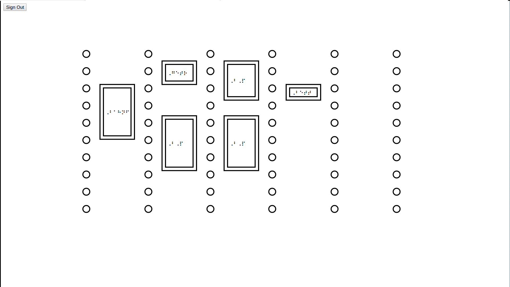

# TactileCalendar
Convert your Google Calendar into a visualization for the blind to be printed on swellpaper



You need d3 to run this project, get the newest version here: https://d3js.org/d3.v4.min.js

How to run
- execute: ```python -m SimpleHTTPServer 8000``` in project directory
- open localhost:8000/calendar.html in your browser
